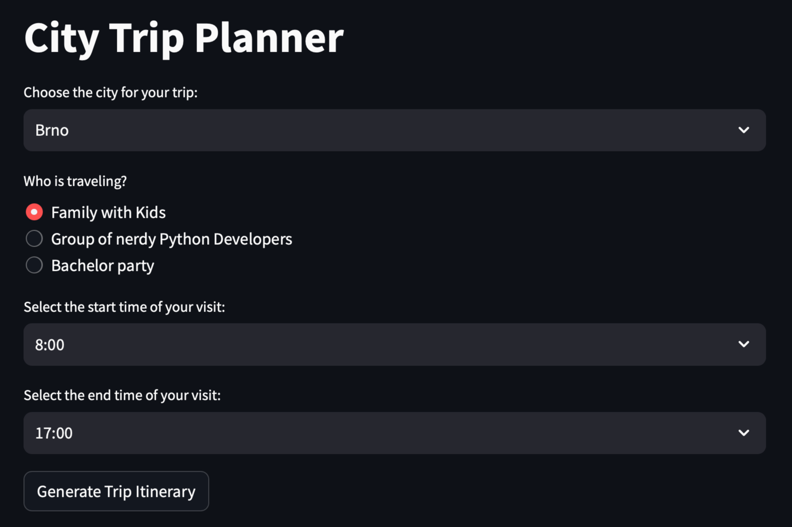
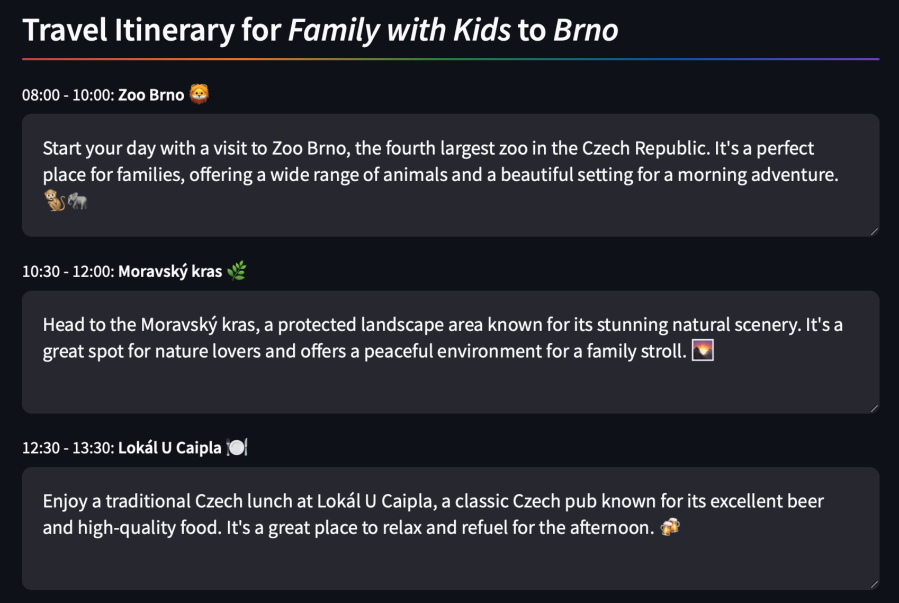
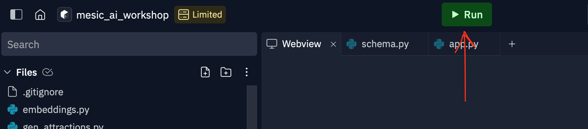

# RAG workshop

# What We Will Create

We will create a trip planner that gathers information from the internet about a given city and prepares a trip itinerary for a specified group.

We will cover the following topics:
* RAG
* Agents
* Embeddings
* Tokenization

<table>
<tr>
<td></td>
<td></td>
</tr>
</table>

## How to run the program

1. Clone repository in Replit
2. Place valid OpenAI API key to `.replit`
3. Hit the green button

